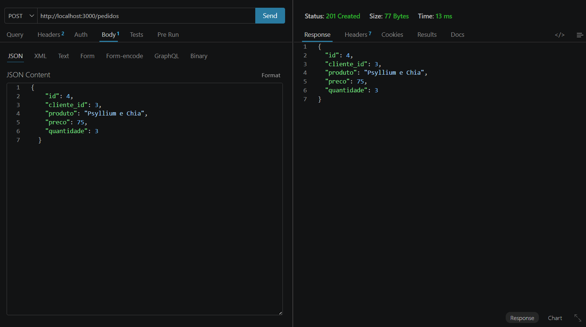
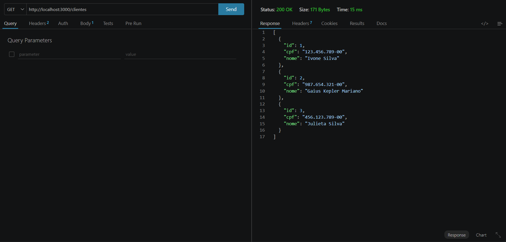
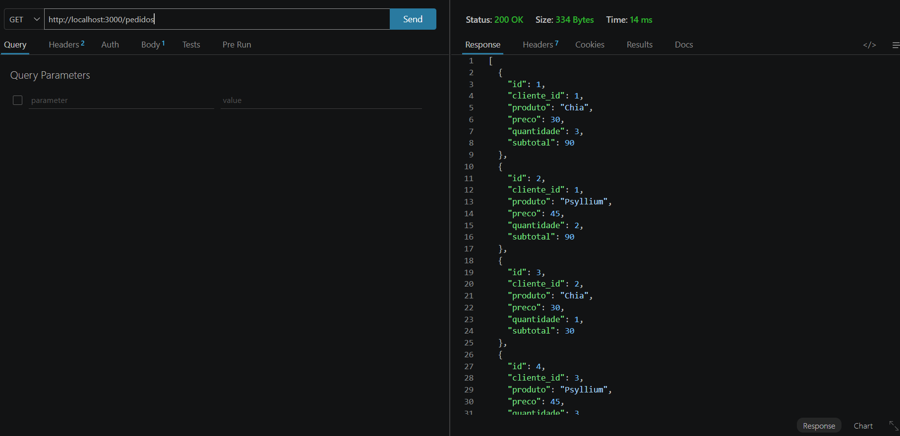
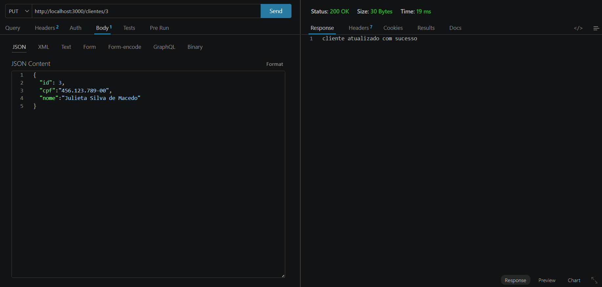
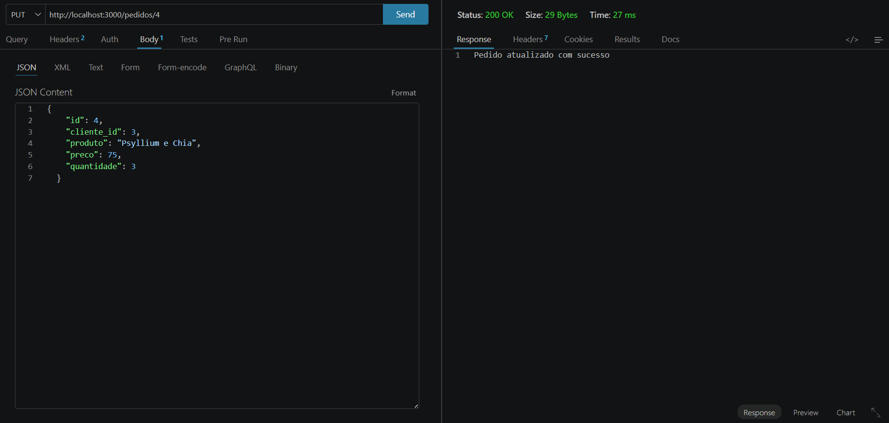
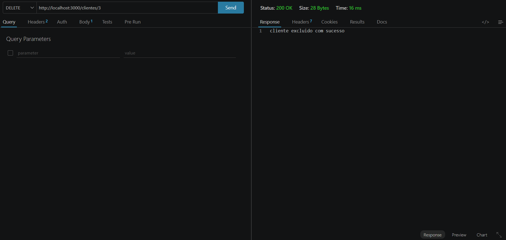
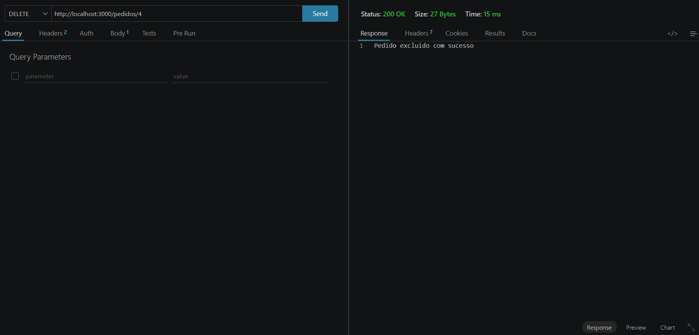

# Pedidos Back-end MVC DC
Back-end com duas coleções mocjup JSON clientes e pedidos, CRUD, para aprender, MVC e UML diagrama de classes
## Diagrama


## Post Pedidos (Cadastrar)


## Get Cliente (Listar)


## Get Pedidos (Listar)


## Put Clientes (Atualizar)


## Put Pedidos (Atualizar)


## Delete Clientes (Remover)


## Delete Pedidos (Remover)


# Tecnologias
- Node.JS
- VsCode (Thunder Client)
- JavaScript
- MVC

# Passos para testar
- Clone este repositório e abra com VsCode
- Instale as dependências e execute com os seguintes comandos no terminal:
```bash
npm install
npm run dev
```